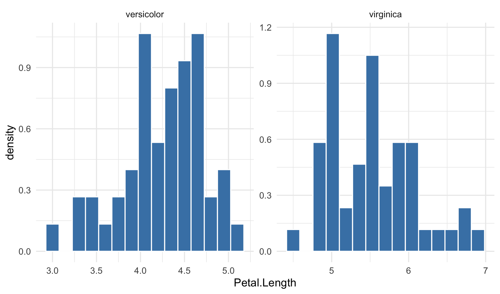

# Detección y tratamiento de datos atípicos (multivariante)

## Enfoque Multivariante

Un estudio multivariante es aquel que estudia más de dos variables de forma simultanea. Su objetivo principal es **capturar las relaciones internas** (correlaciones, dependencias, estructuras latentes) que no se aprecian en un enfoque univariado o bivariado.&#x20;

Al igual que tenemos métodos más sofisticados de _machine learning_ para analizar nuestros datos, los tenemos también para la detección de datos atípicos.&#x20;

Los outliers **no siempre destacan en la distribución global**. En un espacio multidimensional puede haber puntos perfectamente “normales” vistos variable a variable, pero **raros respecto a sus vecinos más próximos**. LOF (Local Outlier Factor) —propuesto por [Breunig et al., 2000](https://dl.acm.org/doi/10.1145/335191.335388)— aborda ese problema midiendo la _desviación local_.

### Local Outlier Factor (LOF)

LOF es un algoritmo de detección de valores atípicos basado en la proximida y la densidad. Evalúa la densidad local de los puntos de datos para identificar valores atípicos. A diferencia de algoritmos de agrupación como k-Nearest Neighbors (KNN), LOF se centra en encontrar observaciones que se desvíen del patrón de densidad local. Es decir, modela los valores atípicos como puntos que están aislados de los datos restantes.

En la práctica, la densidad local se obtiene de los k vecinos más cercanos. La puntuación LOF de una observación es igual a la relación entre la densidad local promedio de sus k vecinos más cercanos y su propia densidad local. Se espera que un _caso_ normal tenga una densidad local similar a la de sus vecinos, mientras que los _casos_ anómalos se espera que tengan una densidad local mucho menor.

En un **KNN**, lo que hacemos es clasificar a un nuevo miembro a una _clase_ o categoría que ya existe. Lo determina según que sus atributos se parezcan a los casos de una categoría u otra. Supongamos los grupos que se presentan en la siguiente gráfica. Se quiere asignar un nuevo punto, en negro. KNN buscará los _k_ puntos más cercanos a éste para encontrar la clase dominante del grupo. Para garantizar la existencia de una clase dominante, k debe ser un número impar.<br>

<figure><figcaption></figcaption></figure>

En este ejemplo se utilizaron las cinco observaciones más cercanas ($$𝐾=5$$), para determinar a qué grupo asignar al nuevo _individuo_. Hay muchas maneras de _medir distancias_. Cada manera se adapta de mejor o peor manera al tipo de atributos con que cuentan los individuos o casos. Esto lo estudiaréis en asignaturas más adelante.&#x20;

**El algoritmo LOF** usa una idea similar al KNN, pero orientado a detectar datos anómalos. Calcula una puntuación (denominada factor de valor atípico local) que refleja el grado de anomalía de las observaciones. Mide la desviación de la _densidad local_ de un punto con respecto a sus vecinos. La idea es detectar las muestras que tienen una densidad sustancialmente menor que sus vecinas.

En la práctica, la densidad local se obtiene de los k vecinos más cercanos. La puntuación LOF de una observación es igual a la relación entre la densidad local promedio de sus k vecinos más cercanos y su propia densidad local. Se espera que un _caso_ normal tenga una densidad local similar a la de sus vecinos, mientras que los _casos_ anómalos se espera que tengan una densidad local mucho menor.

**Resumen del Algoritmo:** Aquí tenéis un esquema básico del algoritmo LOF:

* **Elegir&#x20;**_**k**_ (número de vecinos “cercanos”): $$k = log(n)$$
* Para cada punto de datos:
  * Calcula la distancia a sus k vecinos más cercanos.&#x20;
  * Evalúa la densidad local en función de la distancia promedio a los vecinos.
  * Compara la densidad local del punto con las densidades locales de sus vecinos.
  * Calcula el Local Outlier Factor (LOF) como la relación entre la densidad del punto y la densidad promedio de sus vecinos.

**Interpretación:**

* **LOF > 1:** Un valor LOF mayor que 1 indica que el punto tiene una densidad local significativamente menor que la de sus vecinos. En otras palabras, el punto se encuentra en una región donde la densidad de puntos es menor de lo esperado en comparación con su entorno local. Esto sugiere que el punto podría ser un valor atípico.
* **LOF ≈ 1:** Un valor LOF cercano a 1 indica que el punto tiene una densidad local similar a la de sus vecinos. En este caso, el punto se encuentra en una región donde la densidad de puntos es consistente con su entorno local. No se considera un valor atípico según LOF.
* **LOF < 1:** Un valor LOF menor que 1 indica que el punto tiene una densidad local más alta que la de sus vecinos. Esto puede suceder en regiones de alta densidad donde el punto está más densamente rodeado que la media de sus vecinos. En este caso, el punto puede considerarse menos atípico que sus vecinos.

La costumbre lleva a considerar anómalos a **valores de LOF por encima de** $$1.5$$ **ó** $$2$$**,** pero cada problema debe definir cuál es su umbral adecuado.

**Ejemplo con la base de datos de R iris**

El conjunto de datos Iris consta de 150 observaciones de iris, con 50 observaciones de cada una de las tres especies de iris: setosa, versicolor y virginica.Para cada observación, se miden cuatro características: longitud del sépalo, ancho del sépalo, longitud del pétalo y ancho del pétalo.&#x20;

<figure><figcaption></figcaption></figure>

Es conocida esta dataset por su utilidad en la demostración de técnicas de clasificación y análisis estadístico.&#x20;

```r
#Instala y carga los paquetes
install.packages(c("dbscan", "class"))

library(dbscan)
library(class)
library(ggplot2)
library(patchwork)

# Carga el conjunto de datos iris
data(iris)

# Gráfico de dispersión para mostrar el conjunto de datos iris
p1<-ggplot(iris, aes(x = Sepal.Length, y = Sepal.Width, color = Species)) +
  geom_point() +
   labs(title = "Conjunto de Datos Iris",    
       x = "Longitud del Sépalo", y = "Anchura del Sépalo")

p2<-ggplot(iris, aes(x = Petal.Length, y = Petal.Width, color = Species)) +
  geom_point() +
  labs(title = "Conjunto de Datos Iris",
       x = "Longitud del Pétalo", y = "Anchura del Pétalo")

p1+p2
```

<figure><figcaption></figcaption></figure>

Ahora podemos añadir un datoa atípico y miro qué pasa a nivel univariante

```r
# Añade un valor atípico al conjunto de datos
iris$Species<-as.character(iris$Species)
iris_atipico <- rbind(iris, c(7, 5, 5, 0.7, "Atipico"))
iris_atipico$Species<-as.factor(iris_atipico$Species)
iris_atipico[,c(1:4)]<-lapply(iris_atipico[,c(1:4)],as.numeric)
iris$Species<-as.factor(iris$Species)

source("Tema 2/Funciones_propias.R")
# 1. Obtenemos los nombres de las columnas numéricas
numeric_vars <- names(iris_atipico)[sapply(iris_atipico, is.numeric)]

# 2. Usamos una función anónima para pasar 'data' y el 'nombre'
outliers_results <- lapply(numeric_vars, function(v) outliers(iris_atipico,v))
```



<figure><figcaption></figcaption></figure>



<figure><figcaption></figcaption></figure>



<figure><figcaption></figcaption></figure>



<figure><figcaption></figcaption></figure>



A nivel univariante sólo observaríamos el posible outlier en la variable Sepal.Width

Si miramos su diagrama de dispersión considerando las variables dos a dos vemos lo siguiente

```r
# Gráfico de dispersión para mostrar el conjunto de datos con un valor atípico
p1<-ggplot(iris_atipico, aes(x = Sepal.Length, y = Sepal.Width, color = Species)) +
  geom_point() +
  geom_text(data = iris_atipico[nrow(iris_atipico),], aes(label = "Atipico"), vjust = -1) +
  labs(title = "Conjunto de Datos Iris con un Valor Atípico",    
       x = "Longitud del Sépalo", y = "Anchura del Sépalo")

p2<-ggplot(iris_atipico, aes(x = Petal.Length, y = Petal.Width, color = Species)) +
  geom_point() +
  geom_text(data = iris_atipico[nrow(iris_atipico),], aes(label = "Atipico"), vjust = -1) +
  labs(title = "Conjunto de Datos Iris con un Valor Atípico",
       x = "Longitud del Pétalo", y = "Anchura del Pétalo")

p1+p2
```

<figure><figcaption></figcaption></figure>

Vemos claramente que es un atípico para todas las variables. Por tanto sería un buen candidato para detectarlo con el algoritmo LOF

```r
# Aplica LOF para detección de valores atípicos
k<-round(log(nrow(iris_atipico)))
datos_lof<-scale(iris_atipico[, 1:4]) ##Sólo las variables numéricas

## Breve comprobación de lo que ha hecho scale
library(DataExplorer)
plot_histogram(datos_lof)
plot_histogram(iris_atipico)

#Ejecutar algoritmo lof
lof_resultados <- lof(datos_lof,minPts = k)
iris_atipico$lof<-lof_resultados

#Imprimimos los que son >1.5
iris_atipico[which(iris_atipico$lof>1.5),]

#Vemos la distribución mediante boxplot
ggplot(iris_atipico, aes(y = lof)) +
  geom_boxplot(fill = "skyblue", outlier.color = "red", outlier.shape = 16) +
  theme_minimal() +
  labs(title = "Distribución de LOF Scores")

```

```r
    Sepal.Length Sepal.Width Petal.Length Petal.Width    Species      lof
16           5.7         4.4          1.5         0.4     setosa 1.649470
23           4.6         3.6          1.0         0.2     setosa 1.586739
42           4.5         2.3          1.3         0.3     setosa 3.479334
60           5.2         2.7          3.9         1.4 versicolor 1.545483
61           5.0         2.0          3.5         1.0 versicolor 1.626105
107          4.9         2.5          4.5         1.7  virginica 2.072913
110          7.2         3.6          6.1         2.5  virginica 2.204449
118          7.7         3.8          6.7         2.2  virginica 2.101883
132          7.9         3.8          6.4         2.0  virginica 1.777193
151          7.0         5.0          5.0         0.7    Atipico 3.662890
```

<figure><figcaption></figcaption></figure>

Y después podemos ver la visualización de estos valores con las variables en crudo

```r
p1<-ggplot(iris_atipico, aes(x = Sepal.Length, y = Sepal.Width, colour = lof_resultados)) +
  geom_point() +
  scale_color_gradient(low = "blue", high = "red", name = "LOF Score") +
  labs(title = "Detección de Valores Atípicos con LOF",
       x = "Longitud del Sépalo", y = "Anchura del Sépalo")
       
p2<-ggplot(iris_atipico, aes(x = Petal.Length, y = Petal.Width, colour = lof_resultados)) +
  geom_point() +
  scale_color_gradient(low = "blue", high = "red", name = "LOF Score") +
  labs(title = "Detección de Valores Atípicos con LOF",
       x = "Longitud del Pétalo", y = "Anchura del Pétalo")

p1+p2
```

<figure><figcaption></figcaption></figure>

En el gráfico vemos claramente el valor atípico con un lof muy alto y en la tabla, donde hemos pintado todos los datos que están por encima de lof score > 1.5 vemos como el dato atípico tiene un claro valor que se va del resto con un lof score = 3.66. En este caso no tenemos que borrar todos los valores que estén por encima de 1.5 sino ser capaces de identificar que ese valor dista mucho del resto tanto en valor como en el gráfico. Además en este caso vemos que los valores son raros para casi todas las variables, por tanto podemos sospechar que lo que deberíamos borrar es la observación entera.&#x20;

Además también observamos otra observación "rara" con un LOF score elevado, este corresponde a una observación de setosa. Si miramos luego los gráficos, esta observación está bein clasificada en las características del Pétalo, pero mal clasificada en el Sepalo. Esto puede hacer que salga alta en el LOF pero realmente no es una observación anómala, simplemente algo diferente. No siempre vamos a borrar lo diferente.&#x20;

Finalmente podemos incluir una visualización considerando todas las variables a la vez mediante el uso del análisis de componentes principales (PCA).&#x20;

```r
# Ejecutamos un PCA rápido sobre las variables numéricas
pca_res <- prcomp(datos_lof, center = TRUE)

# Creamos un dataframe para graficar
df_pca <- as.data.frame(pca_res$x)
df_pca$lof <- lof_resultados

ggplot(df_pca, aes(x = PC1, y = PC2, color = lof)) +
  geom_point(aes(size = lof)) +
  scale_color_gradient(low = "lightgrey", high = "darkorange") +
  labs(title = "Proyección PCA y Puntuación LOF",
       subtitle = "Los outliers se alejan del centro de la masa de datos en el espacio latente") +
  theme_bw()
```

<figure><figcaption></figcaption></figure>

Vemos como la observación atípica se va por completo de la nube de puntos y por tanto habría que borrarla.&#x20;
